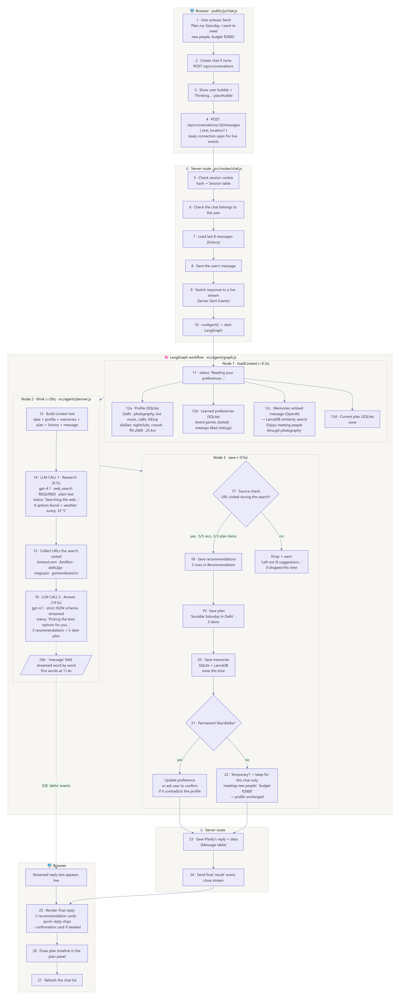
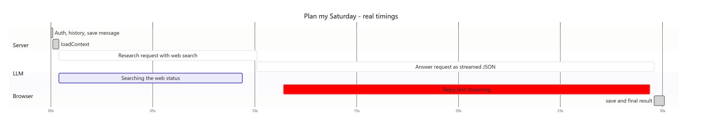
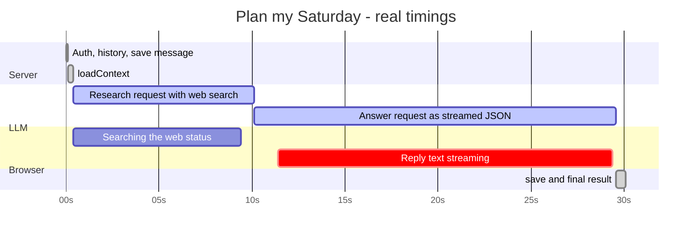

# Planly AI: Request Pipeline

How a single chat message becomes recommendations and a plan, step by step. Each step uses data from a real traced run of this example request:

> **"Plan my Saturday. I want to meet new people, budget ₹2000."**

The run used the real planner code and the OpenAI API (`gpt-4.1`). The user profile was a sample.

---

## 1. Flowchart

The same flowchart appears in three forms: plain text (1a, readable in any viewer), an image (1b), and Mermaid diagram code (1c).

### 1a. Text flowchart

```text
 EXAMPLE: "Plan my Saturday. I want to meet new people, budget ₹2000."

╔═════════════════════════════════════════════════════════════════════════════╗
║  BROWSER · public/js/chat.js                                                ║
╚═════════════════════════════════════════════════════════════════════════════╝
   ┌───────────────────────────────────────────────────────────────────────┐
   │ 1  User presses Send                                                  │
   │    "Plan my Saturday. I want to meet new people, budget ₹2000."       │
   └───────────────────────────────────┬───────────────────────────────────┘
                                       ▼
   ┌───────────────────────────────────────────────────────────────────────┐
   │ 2  No chat yet? → POST /api/conversations   (creates chat "cmu…")     │
   └───────────────────────────────────┬───────────────────────────────────┘
                                       ▼
   ┌───────────────────────────────────────────────────────────────────────┐
   │ 3  Show the user's bubble + "Thinking…" placeholder                   │
   └───────────────────────────────────┬───────────────────────────────────┘
                                       ▼
   ┌───────────────────────────────────────────────────────────────────────┐
   │ 4  POST /api/conversations/:id/messages  { text, location: null }     │
   │    keep the connection open to receive live events                    │
   └───────────────────────────────────┬───────────────────────────────────┘
                                       ▼
╔═════════════════════════════════════════════════════════════════════════════╗
║  SERVER ROUTE · src/routes/chat.js                                          ║
╚═════════════════════════════════════════════════════════════════════════════╝
   ┌───────────────────────────────────────────────────────────────────────┐
   │ 5  Check login: cookie → SHA-256 → Session table        ✔ signed in   │
   │ 6  Check the chat belongs to this user                  ✔ owner       │
   │ 7  Load last 8 messages (history)                       → none (new)  │
   │ 8  Save the user's message                              → Message row │
   │ 9  Switch the response to a live stream (Server-Sent Events)          │
   │ 10 runAgent() → start the LangGraph workflow                          │
   └───────────────────────────────────┬───────────────────────────────────┘
                                       ▼
╔═════════════════════════════════════════════════════════════════════════════╗
║  LANGGRAPH WORKFLOW · src/agent/graph.js                                    ║
╚═════════════════════════════════════════════════════════════════════════════╝
   ┌─ NODE 1 · loadContext ─────────────────────────────────── ~0.3s ──────┐
   │ 11 ▸ status: "Reading your preferences…"                              │
   │ 12 Load in parallel:                                                  │
   │    a) Profile (SQLite)     Delhi · photography, live music, cafés,    │
   │                            hiking · dislikes nightclubs, crowds ·     │
   │                            ₹0–2000 · 25 km · small groups             │
   │    b) Preferences (SQLite) board games (stated) · meetups liked       │
   │    c) Memories             message → OpenAI embedding → LanceDB       │
   │                            → "Enjoys meeting people through           │
   │                               photography"                            │
   │    d) Current plan         none                                       │
   └───────────────────────────────────┬───────────────────────────────────┘
                                       ▼
   ┌─ NODE 2 · think · src/agent/planner.js ─────────────────── ~29s ──────┐
   │ 13 Build the context text:                                            │
   │    date + profile + preferences + memories + plan + history + message │
   │                                   │                                   │
   │                                   ▼                                   │
   │ 14 LLM CALL 1 · RESEARCH                                       9.7s   │
   │    gpt-4.1 · web_search REQUIRED · plain-text output                  │
   │    ▸ status: "Searching the web…" → "Reading what I found…"           │
   │    → 6 options found + weather (Sat: sunny, ~33 °C)                   │
   │      · Purana Qila concert ₹4,500 (over budget)                       │
   │      · LiveWell Circle morning music 07:00 ₹499                       │
   │      · Akshay Vashishtta @ Rubato 19:30                               │
   │      · Simran Choudhary @ Romeo Lane 21:00 ₹999                       │
   │      · House of Boards (board games) ~₹99/hr                          │
   │      · Game On Board (board games)                                    │
   │                                   │                                   │
   │                                   ▼                                   │
   │ 15 Collect the URLs the search actually visited                       │
   │    timeout.com · funillion · delhi2go · magicpin · gameonboard.in     │
   │                                   │                                   │
   │                                   ▼                                   │
   │ 16 LLM CALL 2 · ANSWER                                        19.5s   │
   │    gpt-4.1 · strict JSON schema · streamed                            │
   │    input = context + research notes + source URL list                 │
   │    ▸ status: "Picking the best options for you…"                      │
   │    → message · 5 recommendations · 5-item plan · quick replies ·      │
   │      preference statements · memories                                 │
   │    (Purana Qila left out: over budget)                                │
   │                                   ┆                                   │
   │                                   ┆ "message" streamed word by word   │
   │                                   ┆  → browser (first words at 11.4s) │
   └───────────────────────────────────┬───────────────────────────────────┘
                                       ▼
   ┌─ NODE 3 · save ─────────────────────────────────────────── ~0.5s ─────┐
   │ 17 Source check: was each URL visited during the search?              │
   │        ├── yes → keep        5/5 recommendations · 3/3 plan items     │
   │        └── no  → drop + warn "Left out N suggestions…"  (0 dropped)   │
   │                                   │                                   │
   │ 18 Save recommendations           → 5 Recommendation rows             │
   │ 19 Save plan                      → "Sociable Saturday in Delhi",     │
   │                                     5 items                           │
   │ 20 Save memories (SQLite+LanceDB) → none this time                    │
   │ 21 Permanent like/dislike?                                            │
   │        ├── yes → update preference (or ask to confirm if it           │
   │        │         contradicts the profile)                             │
   │        └── no  → 22 temporary: keep for this chat only                │
   │                    "meeting new people", "budget ₹2000"               │
   │                    → profile unchanged                                │
   └───────────────────────────────────┬───────────────────────────────────┘
                                       ▼
╔═════════════════════════════════════════════════════════════════════════════╗
║  SERVER ROUTE                                                               ║
╚═════════════════════════════════════════════════════════════════════════════╝
   ┌───────────────────────────────────────────────────────────────────────┐
   │ 23 Save Planly's reply + data (Message row)                           │
   │ 24 Send the final "result" event, close the stream          ~29.4s    │
   └───────────────────────────────────┬───────────────────────────────────┘
                                       ▼
╔═════════════════════════════════════════════════════════════════════════════╗
║  BROWSER                                                                    ║
╚═════════════════════════════════════════════════════════════════════════════╝
   ┌───────────────────────────────────────────────────────────────────────┐
   │ 25 Render the final reply:                                            │
   │    "Your Saturday looks fantastic for meeting new people! …"          │
   │    + 5 recommendation cards (Details · Map · rating icons)            │
   │    + quick replies: "More outdoor activities?" · "Photography         │
   │      meetups" · "Swap evening music for Romeo Lane"                   │
   │ 26 Draw the plan in the plan panel:                                   │
   │      07:00  LiveWell Circle – morning live music        ₹499          │
   │      08:45  Break: brunch                                             │
   │      11:00  Board games – House of Boards / Game On Board             │
   │      13:30  Break: lunch                                              │
   │      19:30  Akshay Vashishtta live @ Rubato             <₹500         │
   │ 27 Refresh the chat list in the sidebar                               │
   └───────────────────────────────────────────────────────────────────────┘
```

### 1b. Image



The image file is [pipeline-flowchart.png](pipeline-flowchart.png). Open it directly to zoom in.

### 1c. Mermaid diagram

GitHub draws this automatically. In VS Code it needs the "Markdown Preview Mermaid Support" extension.

```mermaid
flowchart TD
    %% ───────────── Browser ─────────────
    subgraph B1["🖥️ Browser · public/js/chat.js"]
        A1["1 · User presses Send<br/><i>'Plan my Saturday. I want to meet<br/>new people, budget ₹2000.'</i>"]
        A2["2 · Create chat if none<br/>POST /api/conversations"]
        A3["3 · Show user bubble +<br/>'Thinking…' placeholder"]
        A4["4 · POST /api/conversations/:id/messages<br/>{ text, location? }<br/>keep connection open for live events"]
        A1 --> A2 --> A3 --> A4
    end

    %% ───────────── Server route ─────────────
    subgraph S1["⚙️ Server route · src/routes/chat.js"]
        R1["5 · Check session cookie<br/>hash → Session table"]
        R2["6 · Check the chat belongs to the user"]
        R3["7 · Load last 8 messages (history)"]
        R4["8 · Save the user's message"]
        R5["9 · Switch response to a live stream<br/>(Server-Sent Events)"]
        R6["10 · runAgent() → start LangGraph"]
        R1 --> R2 --> R3 --> R4 --> R5 --> R6
    end

    A4 --> R1

    %% ───────────── LangGraph ─────────────
    subgraph G["🧠 LangGraph workflow · src/agent/graph.js"]
        direction TB

        subgraph N1["Node 1 · loadContext  (~0.3s)"]
            L0["11 · status: 'Reading your preferences…'"]
            L1["12a · Profile (SQLite)<br/><i>Delhi · photography, live music, cafés, hiking<br/>dislikes: nightclubs, crowds · ₹0–2000 · 25 km</i>"]
            L2["12b · Learned preferences (SQLite)<br/><i>board games (stated) · meetups liked (ratings)</i>"]
            L3["12c · Memories: embed message (OpenAI)<br/>→ LanceDB similarity search<br/><i>'Enjoys meeting people through photography'</i>"]
            L4["12d · Current plan (SQLite)<br/><i>none</i>"]
            L0 --> L1 & L2 & L3 & L4
        end

        subgraph N2["Node 2 · think  (~29s) · src/agent/planner.js"]
            T1["13 · Build context text<br/>date + profile + memories + plan + history + message"]
            T2["14 · LLM CALL 1 · Research  (9.7s)<br/>gpt-4.1 · web_search REQUIRED · plain text<br/>status: 'Searching the web…'<br/><i>6 options found + weather: sunny, 33 °C</i>"]
            T3["15 · Collect URLs the search visited<br/><i>timeout.com · funillion · delhi2go ·<br/>magicpin · gameonboard.in</i>"]
            T4["16 · LLM CALL 2 · Answer  (19.5s)<br/>gpt-4.1 · strict JSON schema · streamed<br/>status: 'Picking the best options for you…'<br/><i>5 recommendations + 5-item plan</i>"]
            T5[/"16b · 'message' field streamed word by word<br/>first words at 11.4s"/]
            T1 --> T2 --> T3 --> T4
            T4 -.-> T5
        end

        subgraph N3["Node 3 · save  (~0.5s)"]
            V1{"17 · Source check<br/>URL visited during the search?"}
            V2["18 · Save recommendations<br/><i>5 rows in Recommendation</i>"]
            V3["19 · Save plan<br/><i>'Sociable Saturday in Delhi' · 5 items</i>"]
            V4["20 · Save memories<br/>SQLite + LanceDB<br/><i>none this time</i>"]
            V5{"21 · Permanent like/dislike?"}
            V6["Update preference<br/>or ask user to confirm<br/>if it contradicts the profile"]
            V7["22 · Temporary? → keep for this chat only<br/><i>'meeting new people', 'budget ₹2000'<br/>→ profile unchanged</i>"]
            VX["Drop + warn<br/>'Left out N suggestions…'<br/><i>0 dropped this time</i>"]
            V1 -- "yes · 5/5 recs, 3/3 plan items" --> V2
            V1 -- "no" --> VX
            V2 --> V3 --> V4 --> V5
            V5 -- "yes" --> V6
            V5 -- "no" --> V7
        end

        N1 --> N2 --> N3
    end

    R6 --> L0
    T5 -. "SSE 'delta' events" .-> F2

    %% ───────────── Response ─────────────
    subgraph S2["⚙️ Server route"]
        R7["23 · Save Planly's reply + data<br/>(Message table)"]
        R8["24 · Send final 'result' event, close stream"]
        R7 --> R8
    end

    V6 --> R7
    V7 --> R7

    subgraph B2["🖥️ Browser"]
        F2["Streamed reply text appears live"]
        F3["25 · Render final reply:<br/>5 recommendation cards · quick-reply chips<br/>· confirmation card if needed"]
        F4["26 · Draw plan timeline in the plan panel"]
        F5["27 · Refresh the chat list"]
        F2 --> F3 --> F4 --> F5
    end

    R8 --> F3
```



---

## 2. Timeline of the example run



<details>
<summary>Mermaid source</summary>



</details>

| Time | What the user sees |
|---|---|
| 0.0s | Their message bubble and "Thinking…" |
| 0.3s | "Reading your preferences…" |
| 0.4–9.4s | "Searching the web…" → "Reading what I found…" |
| 9.8s | "Picking the best options for you…" |
| **11.4s** | **The reply starts appearing word by word** |
| 29.4s | Recommendation cards, plan timeline and quick replies appear |

---

## 3. Step by step, with the example data

### Stage A: Browser → server · [public/js/chat.js](../public/js/chat.js), [src/routes/chat.js](../src/routes/chat.js)

| # | Step | Example |
|---|---|---|
| 1 | User presses Send | `"Plan my Saturday. I want to meet new people, budget ₹2000."` |
| 2 | Create a conversation if needed | `POST /api/conversations` → `{ id: "cmu…" }` |
| 3 | Show the user bubble and placeholder | "Thinking…" |
| 4 | Send the message and keep the connection open | `{ "text": "Plan my Saturday…", "location": null }` |
| 5 | Check the session | Cookie `planly_session` → SHA-256 → `Session` row |
| 6 | Check ownership | Conversation's `userId` must equal the logged-in user |
| 7 | Load history | Last 8 messages (none, since this is a new chat) |
| 8 | Save the user's message | `Message { role: "user", content: "Plan my Saturday…" }` |
| 9 | Open the live stream | `Content-Type: text/event-stream` |
| 10 | Start the workflow | `runAgent({ userId, conversation, text, history })` |

### Stage B: Node 1 `loadContext` · [src/agent/graph.js](../src/agent/graph.js)

| # | Loaded | Source | Example value |
|---|---|---|---|
| 12a | Profile | SQLite (`Profile`) | Delhi · photography, live music, cafés, hiking · dislikes nightclubs, crowded places · ₹0–2000 · 25 km · small groups |
| 12b | Learned preferences | SQLite (`Preference`) | `board games` (stated in chat) · `category:meetup` liked (from ratings) |
| 12c | Relevant memories | OpenAI embedding → **LanceDB** | "Enjoys meeting people through photography" |
| 12d | Current plan | SQLite (`Plan`) | none |

**Output: the context text sent to the LLM (step 13)**
```
Today is Thursday, 2026-10-08.

About the user:
Home location: Delhi, National Capital Territory of Delhi, India
Interests: photography, live music, cafes, hiking
Dislikes: nightclubs, crowded places
Learned likes: board games (stated)
Feedback patterns: meetup liked (from feedback)
Social: wants to meet new people; preferred group size: small
Budget per outing: 0–2000 INR
Willing to travel: up to 25 km
Things they've told you before:
- Enjoys meeting people through photography

Current plan: none.

User's message: Plan my Saturday. I want to meet new people, budget ₹2000.
```

### Stage C: Node 2 `think`, LLM call 1: Research · [src/agent/planner.js](../src/agent/planner.js)

| Setting | Value |
|---|---|
| Model | `gpt-4.1` (`OPENAI_MODEL`) |
| Tool | `web_search`, with `tool_choice: "required"` so the model can't skip the search |
| Output | Plain text with citations. Strict-JSON mode drops the links, so this step stays in text. |
| Instructions | `RESEARCH_INSTRUCTIONS` in [src/agent/prompts.js](../src/agent/prompts.js) |
| Time | **9.7s** |

**Research notes (excerpt):**
> Weather for Delhi on Saturday, October 10: warm and mostly sunny, ~33 °C, clear evening.
> 1. "Dusk to Dawn": Amrita Kaur at Purana Qila, 7 PM, **≈ ₹4,500 (above budget)**, timeout.com
> 2. LiveWell Circle by Max Estates: morning live music, 7 AM, Cyber Hub Gurugram, ₹499, funillion
> 3. Akshay Vashishtta live: Rubato Bistro, 7:30 PM, funillion
> 4. Simran Choudhary live: Romeo Lane, 9 PM, ₹999, delhi2go.in
> 5. House of Boards: board game café, Hudson Lane, ≈ ₹99/hr, magicpin.in
> 6. Game On Board: board game café, Malviya Nagar, gameonboard.in

**Step 15: URLs the search visited (used later for the source check):**
```
https://www.timeout.com/delhi/delhi-events-in-october
https://funillion.netlify.app/in/delhi/concerts-live-music
https://delhi2go.in/events/music/this-weekend
https://magicpin.in/New-Delhi/Hudson-Lane/Restaurant/House-Of-Boards/store/1777915
https://www.gameonboard.in/
```

### Stage D: Node 2 `think`, LLM call 2: Answer · [src/agent/planner.js](../src/agent/planner.js)

| Setting | Value |
|---|---|
| Model | `gpt-4.1` |
| Input | Context text + research notes + source URL list |
| Output | Strict JSON (`PLANNER_SCHEMA`). `message` is the first field, so it can be streamed |
| Rule | Use only options and URLs from the research; never invent |
| Time | **19.5s**; first words on screen at **11.4s** |

**Answer (abridged):**
```json
{
  "message": "Your Saturday looks fantastic for meeting new people! You could start with live music at LiveWell Circle, enjoy an afternoon of board games at House of Boards or Game On Board, then wrap up the evening with a live music session at Rubato or Romeo Lane, each within your ₹2,000 budget…",
  "intent": "make_plan",
  "recommendations": [
    { "title": "LiveWell Circle by Max Estates – Morning Live Music", "kind": "event", "category": "music",
      "startDate": "2026-10-10", "startTime": "07:00", "priceText": "₹499", "meetsPeople": true,
      "url": "https://funillion.netlify.app/in/delhi/concerts-live-music",
      "reason": "You'll meet like-minded people in a calm, musical setting that's perfect to start your Saturday." },
    { "title": "House of Boards, Hudson Lane – Board Game Café", "kind": "place", "category": "games", "priceText": "Approx. ₹99/hour", "meetsPeople": true, "…": "…" },
    { "title": "Game On Board, Malviya Nagar – Board Game Café", "kind": "place", "category": "games", "…": "…" },
    { "title": "Live Singing – Akshay Vashishtta at Rubato", "startTime": "19:30", "priceText": "<₹500 (see listing)", "…": "…" },
    { "title": "Simran Choudhary Live at Romeo Lane", "startTime": "21:00", "priceText": "₹999", "…": "…" }
  ],
  "plan": { "title": "Sociable Saturday in Delhi", "startDate": "2026-10-10", "endDate": "2026-10-10", "items": ["… see below …"] },
  "temporaryExclusions": [],
  "preferenceStatements": [
    { "subject": "meeting new people", "sentiment": "like", "permanence": "temporary", "confidence": 1 },
    { "subject": "budget per outing 2000 INR", "sentiment": "like", "permanence": "temporary", "confidence": 1 }
  ],
  "memoriesToSave": [],
  "quickReplies": ["Can you suggest more outdoor activities?", "I'd like to focus on photography meetups.", "Swap the evening music for the Romeo Lane event."]
}
```

**Plan:**

| Time | Duration | Item | Price |
|---|---|---|---|
| 07:00 | 1h 30m | LiveWell Circle – Morning Live Music (Cyber Hub, Gurugram) | ₹499 |
| 08:45 | 1h 15m | *Break: breakfast / brunch* | — |
| 11:00 | 2h 30m | Board games – House of Boards or Game On Board | ~₹99/hr |
| 13:30 | 1h | *Break: lunch* | — |
| 19:30 | 1h 30m | Live Singing – Akshay Vashishtta at Rubato | <₹500 |

The ₹4,500 Purana Qila concert was found in research but **left out by the LLM because it was over budget**.

### Stage E: Node 3 `save` · [src/agent/graph.js](../src/agent/graph.js), [learning.js](../src/agent/learning.js), [memory.js](../src/agent/memory.js)

| # | Step | Rule | Example result |
|---|---|---|---|
| 17 | Source check | Keep a recommendation or plan item only if its URL (ignoring `www.`, trailing `/` and `utm_*`) is a page the search visited. With no source list, nothing is kept. | **5/5 recommendations kept, 3/3 plan activities kept**, 0 dropped |
| 18 | Save recommendations | One `Recommendation` row each, so ratings can link back | 5 rows |
| 19 | Save plan | Create a new plan, or replace the items of this chat's current plan | "Sociable Saturday in Delhi", 5 items |
| 20 | Save memories | Embed; skip if a near-duplicate exists in LanceDB; else save to SQLite + LanceDB | none |
| 21 | Permanent preferences | `learnFromStatement`: moderate confidence on first mention, higher on repeats; **ask the user** if it contradicts the profile | none (both statements were temporary) |
| 22 | Temporary exclusions and preferences | Stored on this conversation only | profile unchanged |

### Stage F: Back to the browser · [src/routes/chat.js](../src/routes/chat.js), [public/js/chat.js](../public/js/chat.js)

| # | Step | Example |
|---|---|---|
| 23 | Save Planly's reply | `Message { role: "assistant", content: "Your Saturday looks fantastic…", data: { recommendations, planId, quickReplies, … } }` |
| 24 | Send the final event | `event: result` with the reply, 5 recommendations, the plan and quick replies |
| 25 | Render | Formatted reply, 5 recommendation cards (Details, Map, rating icons) and 3 quick-reply chips |
| 26 | Plan panel | Timeline for "Sociable Saturday in Delhi" with Save, Replace and Remove |
| 27 | Sidebar | The chat appears in the Recent list |

---

## 4. Live events sent to the browser

| Event | When | Payload example | Browser does |
|---|---|---|---|
| `status` | Several times | `{ "text": "Searching the web…" }` | Updates the progress line |
| `delta` | Many times during call 2 | `{ "text": "Your Saturday looks" }` | Appends text to the reply |
| `result` | Once, at the end | `{ message, recommendations, plan, quickReplies, confirm, warnings, timings }` | Renders the final reply, cards and plan |
| `error` | On failure | `{ "message": "OPENAI_API_KEY is not set…" }` | Shows the error (no substitute answer) |

---

## 5. What this example shows

| Observation | Detail | Possible improvement |
|---|---|---|
| Call 2 is the slowest part | 19.5s to write ~7,000 characters of JSON | Faster model for call 2, or a shorter output |
| An interest went unused | The photography memory reached the LLM, but research found no photo walks | Targeted search for the user's top interests |
| A few loose decisions | Gurugram may exceed 25 km; "<₹500" is a guess; one plan item offers "A **or** B" | Stricter prompt rules for distance, listed prices only, one choice per item |
| Links are listing pages | e.g. "live music in Delhi" rather than the event's own page | Prefer event-specific pages in the research instructions |

---

## 6. Where each piece lives

| Piece | Technology | File |
|---|---|---|
| Chat UI and live stream reader | HTML/CSS/vanilla JS | [public/js/chat.js](../public/js/chat.js) |
| HTTP route + stream | Express | [src/routes/chat.js](../src/routes/chat.js) |
| Workflow | LangGraph.js `StateGraph`: `loadContext → think → save` | [src/agent/graph.js](../src/agent/graph.js) |
| LLM calls | OpenAI Responses API (web search + strict JSON) | [src/agent/planner.js](../src/agent/planner.js) |
| Prompts and output schema | — | [src/agent/prompts.js](../src/agent/prompts.js) |
| Preference learning | — | [src/agent/learning.js](../src/agent/learning.js) |
| Memories | OpenAI embeddings + LanceDB | [src/agent/memory.js](../src/agent/memory.js), [src/db/vector.js](../src/db/vector.js) |
| Data | Prisma + SQLite | [prisma/schema.prisma](../prisma/schema.prisma) |
